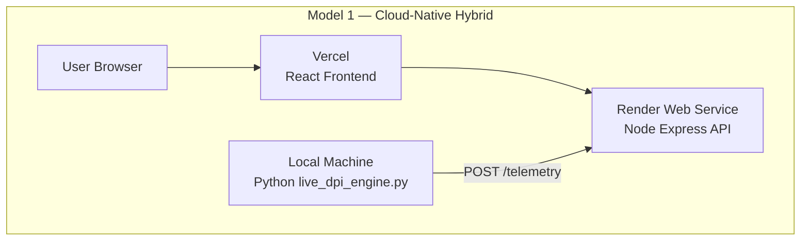
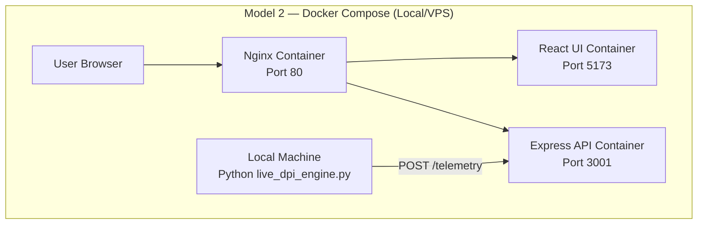

# Architecture Documentation

This document explains the Dual Architecture deployment of **TrueFlow-Analyzer**.

## Model 1 — Cloud-Native (Hybrid approach)

*Note: Due to the 2.5GB ML model size, the Python engine cannot run on free serverless hosting and must run locally.*

## Model 2 — Docker Compose (Self-Hosted)

